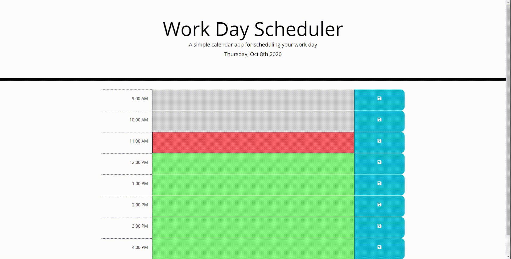
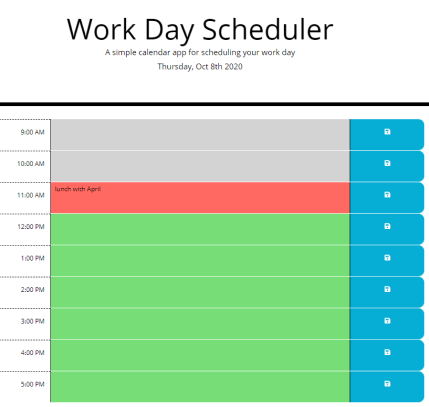

# 05: Third party API: Workday Sceduler

## INRODUCTION 

This "Workday Scheduler" application is a day planner that allows user to input and record to-do items in the time slot with a given pre-set time block.  Using Moment.js, user can input todo items with its current state of time in the day planner. The planner's time slot is color coded to represent its relation to the current time.  

## REQUIREMENT

This application must be able to process:
* User's input in it's description section.
* Record the input and re-display on the next session.

Language used:
* Html
* Bootstrap
* JavaScript
* Moment.js

##  APPLICATION PREVIEW

## STEPS

### 1. User is presented with start page that display the current day and date.
### 2. Then user can input descriptions and their activity of the day on the appropriate time slot.

* The scheduler's time block is color coded to represent the time that has past in grey, at present in red and future in green. 

### 3. User can save details and descriptions typed in the planner. Details and descriptions saved will be displayed on user's next session. 

## MAINTAINER 
This is an individual assignment created by Carolina Yoedhana.
* GitHub Link: https://github.com/CarolinaYo/workday-scheduler-cy.git
* GitHub Page Link: https://carolinayo.github.io/workday-scheduler-cy/
